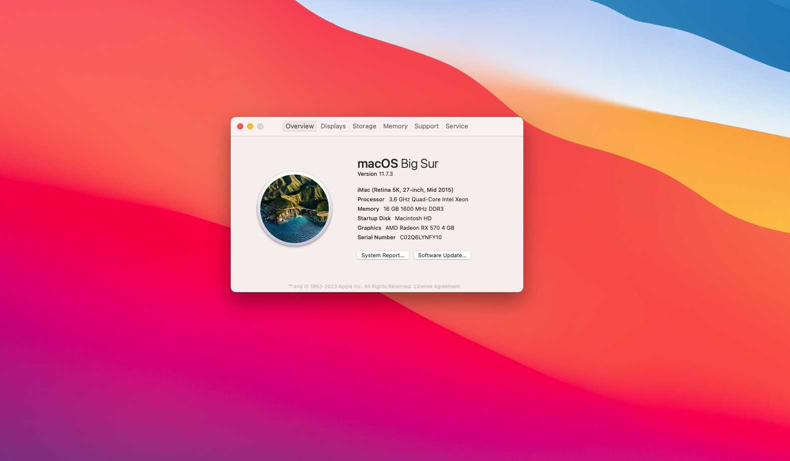

# Hackintosh

## 目录

- [中文版](#工具)
  - 工具
  - 镜像1：E3v3 + RX570显卡ITX主机
    - 概述+硬件介绍
    - 更新记录
    - 测试
  - 参考
- [English](#Tools)
  - Tools
  - EFI1: E3v3 + RX570 itx build
    - Intro
    - Updates
    - Tests
  - References

---

## 工具

- [OpenCore](https://github.com/acidanthera/OpenCorePkg)
- [SSDTTime](https://github.com/corpnewt/SSDTTime)
- [USB mapping tools](https://github.com/USBToolBox/tool)
- [ProperTree](https://github.com/corpnewt/ProperTree)
- [GenSMBIOS](https://github.com/corpnewt/GenSMBIOS)
- [balenaEtcher](https://www.balena.io/etcher)
- [OpenCore Scanity Checker](https://opencore.slowgeek.com/)
- [OpenCore Auxilliary Tool](https://github.com/ic005k/OCAuxiliaryTools)
- [DiskGenius](https://www.diskgenius.cn/)
- [sysin](https://sysin.org/)
- ~~[IASL](https://acpica.org/)~~

## E3v3的EFI

### 硬件配置介绍

| CPU      |          Xeon E3 1276v3 (核显Intel P4600)           |
| -------- | :-------------------------------------------------: |
| 主板     | 微星B85I (网卡型号瑞昱8111G Gigabit Lan controller) |
| 显卡     |          蓝宝石RX470D (刷蓝宝石570的bios)           |
| 内存     |                芝奇 DDR3 8G 1866MHz                 |
| 无线网卡 |                  博通 BCM94360HMB                   |
| 硬盘     |                    致钛 SC001 1T                    |

### 更新记录

#### 2023-03-20: 开始根据教程进行EFI配置

- 通过OpenCore下载适合的MacOS镜像
- 通过SSDTTime获取本机的`DSDT.aml`

#### 2023-03-21

- 从OpenCore指南里下载适配硬件的`kext`
- 使用USB mapping tool创建本机的USB映射，生成`UTBMap.kext`，并用ProperTree检查单个控制器是否超过15条通道
- 使用SSDTTime生成`SSDT-EC.aml`和`SSDT-PLUG.aml`
- 使用ProperTree调整`config.plist`
  - 
- 根据OpenCore指南将`Monterey 12.6.3`的`BaseSystem.dmg`和`BaseSystem.chunklist`放到u盘根目录中的`com.apple.recovery.boot`路径下，引导程序找不到镜像
- 使用Etcher烧录`Monterey 12.6.3`镜像到u盘，在`config.plist`中将机型设置为`iMac17,1`；用DiskGenius将efi拷贝到u盘efi分区；尝试安装Monterey，跑码一会后失败，进入Windows
- 使用Etcher烧录`Big Sur 11.7.3 (20G1116)`镜像到u盘，没有efi分区:D

#### 2023-03-22

- 从`sysin.org`下载`Big Sur 11.7.3 (20G1116)`镜像并使用Etcher烧录到u盘，用DiskGenius拷贝efi到efi文件夹下，成功安装

### 问题

- 桌面左上角出现一小块显示问题
- 为了解决上面的问题，直接重启了，于是会被直接引导到Windows（因为没有用OC引导替换原来的引导）
- 但👴想摆烂几天，过几天再修😝

## 参考资料

- [OpenCore 官方指南](https://dortania.github.io/OpenCore-Install-Guide)
- 司波图的视频：[b站](https://www.bilibili.com/video/BV1hA411t7dr/)，[YouTube](https://www.youtube.com/watch?v=Lu6Kmz5aDhY)
- 大头蔡Cass的视频：[b站](https://space.bilibili.com/16323318/channel/collectiondetail?sid=296068)，[YouTube](https://www.youtube.com/playlist?list=PLdKp3l7lXf-Ud-WGhrWn9cyPXpgcygUhd)

---

## Tools

- [OpenCore](https://github.com/acidanthera/OpenCorePkg)
- [SSDTTime](https://github.com/corpnewt/SSDTTime)
- [USB mapping tools](https://github.com/USBToolBox/tool)
- [ProperTree](https://github.com/corpnewt/ProperTree)
- [GenSMBIOS](https://github.com/corpnewt/GenSMBIOS) - generates fake Mac serial number
- [balenaEtcher](https://www.balena.io/etcher) - moves MacOS image to USB stick
- [OpenCore Scanity Checker](https://opencore.slowgeek.com/) - checks your mental health status
- [OpenCore Auxilliary Tool](https://github.com/ic005k/OCAuxiliaryTools) - does ProperTree and GenSMBIOS things, with a better GUI
- [DiskGenius](https://www.diskgenius.cn/) - moves your finished files to the efi sector in the USB stick
- [sysin](https://sysin.org/) - provides MacOS images
- ~~[IASL](https://acpica.org/)~~ - decompiles `.aml` file

## Intel Xeon E3 1276v3

### Hardwares

| CPU         | Intel Xeon E3 1276v3 (integrated graphics Intel P4600) |
| ----------- | :----------------------------------------------------: |
| Motherboard |    MSI B85I (Realtek 8111G Gigabit Lan controller)     |
| GPU         |         Sapphire RX470D (Sapphire RX570 bios)          |
| RAM         |                G-SKILL DDR3 8G 1866MHz                 |
| WLAN        |                  Broadcom BCM94360HMB                  |
| Drive       |                    Zhitai SC001 1T                     |

### Updates

#### 2023-03-20: Start to configure my EFI

- Download MacOS image using OpenCore
- Fetch `DSDT.aml` file using SSDTTime

#### 2023-03-21

- Download `kext` files from OpenCore guide
- Create USB mapping `UTBMap.kext` using USB mapping tool, and check if each USB controller has more than 15 lanes? using ProperTree
- Fetch `SSDT-EC.aml` and `SSDT-PLUG.aml` using SSDTTime
- Configure `config.plist`
- 

## Reference

- [OpenCore guide](https://dortania.github.io/OpenCore-Install-Guide)
- Videos by 司波图 on [bilibili](https://www.bilibili.com/video/BV1hA411t7dr/), and [Youtube](https://www.youtube.com/watch?v=Lu6Kmz5aDhY)
- Videos by 大头蔡Cass on [bilibili](https://space.bilibili.com/16323318/channel/collectiondetail?sid=296068), and [Youtube](https://www.youtube.com/playlist?list=PLdKp3l7lXf-Ud-WGhrWn9cyPXpgcygUhd)

